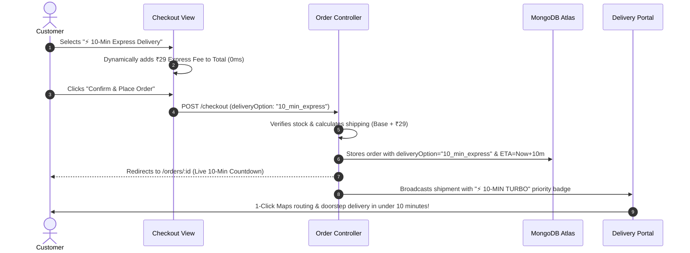

# 🏪 My Local Shop — Hyperlocal E-Commerce & 10-Minute Express Delivery Platform

[](https://nodejs.org/)
[](https://expressjs.com/)
[](https://www.mongodb.com/atlas)
[](https://tailwindcss.com/)
[-b4ca65?style=for-the-badge&logo=javascript&logoColor=white)](https://ejs.co/)
[](https://flipkart-ecommerce-wql5.onrender.com)

A production-ready, full-stack hyperlocal e-commerce and quick-commerce platform rebranded to **My Local Shop**. Features a modern **3D UI Design System**, **⚡ 10-Minute Express Delivery**, 8 rich product verticals (including **Groceries**, **Food & Snacks**, and **Medicines & Healthcare**), and an enterprise 3-tier Role-Based Access Control (RBAC) engine for **Customers**, **Delivery Partners**, and **Store Admins**.

---

## 📑 Table of Contents
1. [What is My Local Shop?](#-what-is-my-local-shop)
2. [Why Server-Side Rendering (SSR) Instead of CSR?](#-why-server-side-rendering-ssr-instead-of-client-side-rendering-csr)
3. [Comprehensive Tech Stack](#%EF%B8%8F-comprehensive-tech-stack)
4. [APIs Used (External & Internal)](#-apis-used-external--internal)
5. [⚡ 10-Minute Express Delivery Engine](#-10-minute-express-delivery-engine)
6. [🛒 8 Product Categories & Catalog](#-8-product-categories--catalog)
7. [👥 3-Tier Role-Based Access Control (RBAC)](#-3-tier-role-based-access-control-rbac)
8. [🎨 Modern 3D Tactile UI Design System](#-modern-3d-tactile-ui-design-system)
9. [🔑 Verified Credentials & Portal Access](#-verified-credentials--portal-access)
10. [💻 Quick Start & Local Setup](#-quick-start--local-setup)
11. [🧪 Automated Verification Tests (8/8 Suites)](#-automated-verification-tests-88-suites)
12. [🌐 Live Deployment](#-live-deployment)

---

## 🚀 What is My Local Shop?

**My Local Shop** is a next-generation hyperlocal digital marketplace that combines traditional catalog shopping with modern **Quick Commerce**. It bridges neighborhood brick-and-mortar stores, local delivery fleets, and doorstep shoppers:

- **For Customers**: Shop electronics, trending fashion, kitchen essentials, daily fresh groceries, dairy/snacks, and emergency medicines with either Standard Local Delivery or **Guaranteed 10-Minute Express Delivery**.
- **For Delivery Partners**: Dedicated dispatch portal with 1-click turn-by-turn Google Maps GPS navigation, cash-on-delivery settlement, and instant status updates.
- **For Administrators**: Real-time sales velocity analytics (daily/weekly dual-axis charts), dark-store order dispatching, 5-stage return management, and audit trails.

---

## ⚡ Why Server-Side Rendering (SSR) Instead of Client-Side Rendering (CSR)?

A foundational architectural decision in **My Local Shop** is the choice of **Server-Side Rendering (SSR)** using **Node.js, Express, and EJS** over **Client-Side Rendering (CSR)** single-page apps (like vanilla React/Vite/CRA). 

Here is an in-depth breakdown of why SSR is the superior choice for an e-commerce platform:

### 1. Architectural Comparison Matrix

| Evaluation Metric | 🖥️ Server-Side Rendering (SSR) — *Our Choice* | 🌐 Client-Side Rendering (CSR) — *React SPA* |
| :--- | :--- | :--- |
| **First Contentful Paint (FCP)** | ⚡ **Ultra-Fast (100–300ms)**. Fully constructed HTML is streamed directly from the server. | 🐢 **Slow (1500–4000ms)**. Browser gets an empty `<div id="root"></div>`, then must download, parse, and execute heavy JS bundles before anything renders. |
| **SEO & Web Crawlers** | 🏆 **Perfect 100% Indexing**. Googlebot, Bing, social crawlers (Twitter/WhatsApp unfurls) immediately read pre-rendered titles, descriptions, and Open Graph cards. | ⚠️ **Unreliable**. Many crawlers fail or timeout while waiting for client-side JavaScript hydration and asynchronous API fetches. |
| **Performance on Budget Devices** | 📱 **Minimal CPU overhead**. Rendering happens on the high-powered server. Low-end budget smartphones just display HTML/CSS smoothly. | 🔥 **High Battery & CPU strain**. Budget phones struggle parsing and executing 2MB+ JavaScript bundles, causing UI jank. |
| **Data Security & Business Logic** | 🔒 **Tamper-Proof**. Prices, inventory bounds, discounts, and promo logic are calculated exclusively on the server before rendering HTML. | ⚠️ **Vulnerable**. Client bundles expose API routes, endpoints, and internal state logic to reverse-engineering via DevTools. |
| **Authentication & RBAC** | 🛡️ **Zero Flash of Protected Content**. JWT is verified in secure HTTP-only cookies before the HTML is generated. Unauthorized users never receive admin markup. | ⚠️ **Auth Flickering**. The client renders a loading spinner or flashes a layout before an asynchronous `/api/me` check redirects them. |
| **BFCache & Back-Button Sync** | 🔄 **Instant & Consistent**. HTTP anti-cache headers paired with client `pageshow` sync ensure cart counts and order states never desynchronize. | ⚠️ **State Desync**. Browsing back often displays stale React state unless complicated global cache invalidation is implemented. |

---

### 2. Core Reasons Detailed

#### A. Search Engine Optimization (SEO) is Non-Negotiable for E-Commerce
In e-commerce, **organic search traffic represents 40–60% of revenue**. Every product (e.g., *"Apple iPhone 15 Pro Max"*, *"Aashirvaad Whole Wheat Atta 5kg"*) must have a unique URL with rich meta tags, canonical links, and valid schema. With SSR:
- The server generates complete HTML containing the product title, schema markup, price, and stock status on request.
- Search engine spiders index catalog pages instantly on the first crawl pass without waiting for client-side execution budgets.

#### B. First Contentful Paint (FCP) & Conversion Rates
Studies by Google and Amazon demonstrate that **every 100ms of latency reduces e-commerce conversions by 1%**:
- In a CSR app, the user stares at a blank screen or spinner while downloading megabytes of JavaScript.
- In **My Local Shop (SSR)**, the server queries MongoDB and responds with ready-to-display HTML and Tailwind CSS in a single round trip. The user sees products and images almost instantaneously.

#### C. Better Resilience for Tier-2 / Tier-3 Mobile Networks
Local shop customers and delivery agents frequently operate on spotty 3G/4G cellular networks:
- Sending a 35KB pre-rendered HTML document over poor connectivity succeeds far faster and more reliably than downloading a multi-megabyte React bundle, vendor scripts, and separate JSON payloads.

#### D. Hardened Security & Zero Client Exposure
- **No Client-Exposed API Keys**: Sensitive keys (such as the Brevo transactional mail API key) live strictly on the server and are never bundled into client-side code.
- **HTTP-Only Cookie Sessions**: Authentication tokens (JWT) are stored in secure, `HttpOnly`, `SameSite=Lax` cookies that cannot be accessed or stolen by malicious browser scripts (immune to XSS token theft).

---

## 🛠️ Comprehensive Tech Stack

### 1. Frontend & View Layer
- **Template Engine**: [EJS (Embedded JavaScript)](https://ejs.co/) — Server-Side Rendering of modular views, layouts, and reusable partials.
- **Styling Framework**: [Tailwind CSS 3.x](https://tailwindcss.com/) — Utility-first styling with extended custom 3D depth utilities (`.card-3d`, `.btn-3d-amber`, `.orb-3d`).
- **Icons & Visuals**: [FontAwesome 6 Pro CDN](https://fontawesome.com/) — Vector iconography for cart, store, delivery trucks, lightning badges, and status steppers.
- **Client Interactivity**: Vanilla JavaScript (ES6+) — Lightweight, zero-framework reactive enhancements for address lookups, dynamic delivery speed price updates, and BFCache cart synchronization.

### 2. Backend & Business Logic
- **Runtime**: [Node.js (v18+ LTS)](https://nodejs.org/) — Asynchronous, event-driven JavaScript engine.
- **Web Framework**: [Express.js 4.x](https://expressjs.com/) — Fast, unopinionated routing engine with custom middleware pipelines for auth, error handling, and role gating.
- **Security & Cryptography**:
  - `bcryptjs` — 10-round salted password hashing.
  - `jsonwebtoken (JWT)` — Stateless cryptographic token signing and verification stored in secure HTTP-only cookies.
- **Session & Cookie Parser**: `cookie-parser` — Parses incoming cookie headers for authentication tokens.

### 3. Database & Data Modeling
- **Database**: [MongoDB Atlas](https://www.mongodb.com/atlas) — Cloud-hosted NoSQL document database with replica sets and automatic failover.
- **ODM (Object Data Modeling)**: [Mongoose 8.x](https://mongoosejs.com/) — Schema validation, atomic operations (`$inc`), population, and compound indexes (`userId`, `orderStatus`, `createdAt`).

### 4. Data Visualization & Analytics
- **Chart Engine**: [Chart.js 4.x](https://www.chartjs.org/) — Dual Y-axis interactive sales trend visualizations (gross revenue lines + order volume bars) with 0ms client switching between Daily (7-day) and Weekly (4-week) views.

### 5. Infrastructure & Cloud Deployment
- **Hosting**: [Render Cloud Web Services](https://render.com/) — Automated zero-downtime deployment directly connected to GitHub repository branches.
- **Process & Server**: Native Node HTTP server with graceful shutdown listeners and test harness bypass hooks.

---

## 🌐 APIs Used (External & Internal)

### 1. External Third-Party APIs

| API Provider | Endpoint / Integration | Protocol | Purpose in Platform |
| :--- | :--- | :---: | :--- |
| **India Post Postal PIN Code API** | `https://api.postalpincode.in/pincode/{PINCODE}` | `HTTPS GET` | Validates 6-digit Indian postal PIN codes in real time during checkout. Automatically resolves and auto-fills State, District, and available Postal Post Offices. |
| **Brevo Transactional Email REST API** | `https://api.brevo.com/v3/smtp/email` | `HTTPS POST (Port 443)` | Cloud email service for delivering real 6-digit OTP verification codes to customer inboxes. Runs over HTTPS port 443 to bypass cloud SMTP port restrictions. |
| **Google Maps Universal Navigation API** | `https://www.google.com/maps/dir/?api=1&destination={LAT,LNG|ADDR}` | `URL Schema` | One-tap GPS navigation button in the Delivery Partner portal that launches turn-by-turn driving directions directly to the customer doorstep. |

---

### 2. Internal Platform REST APIs

| Internal API Endpoint | Method | Access Level | Response Format | Description |
| :--- | :---: | :---: | :---: | :--- |
| `/health` | `GET` | Public | `JSON` | Health check monitoring returning server status (`{ status: "UP" }`) and timestamp. |
| `/cart/count` | `GET` | Customer / Guest | `JSON` | Lightweight endpoint returning current cart count and product IDs for 0ms BFCache back-button sync. |
| `/admin/api/sales-trends` | `GET` | Admin Only (`403` for others) | `JSON` | Delivers structured 7-day daily and 4-week weekly sales revenue, order volumes, and average order values. |
| `/api/pincode/:pin` | `GET` | Public | `JSON` | Server-side proxy cache for Indian PIN code lookups ensuring high resilience if third-party endpoints rate-limit. |

---

## ⚡ 10-Minute Express Delivery Engine

To serve urgent neighborhood needs (morning milk, breakfast bread, cooking oil, fever medication), **My Local Shop** incorporates an end-to-end **Quick Commerce (10-Minute Express)** pipeline:



---

## 🛒 8 Product Categories & Catalog

The platform catalog covers both durable goods and daily instant essentials:

1. 📱 **Mobiles**: Flagship smartphones (iPhone 15 Pro Max, Galaxy S24 Ultra, OnePlus 12).
2. 💻 **Electronics**: High-performance laptops, noise-canceling headphones, smartwatches.
3. 👕 **Fashion**: Cotton shirts, denim, athletic sneakers, accessories.
4. 🍳 **Home & Kitchen**: Non-stick cookware, mixer grinders, storage sets.
5. 🧊 **Appliances**: Smart refrigerators, microwave ovens, inverter air conditioners.
6. 🌾 **Groceries**: Aashirvaad Whole Wheat Atta, Fortune Sunflower Oil, India Gate Basmati Rice, Tata Salt, Amul Pure Cow Ghee, Tata Sampann Toor Dal.
7. 🥛 **Food & Snacks**: Amul Taaza Fresh Milk, Britannia Whole Wheat Bread, Farm Fresh Grade-A Eggs, Maggi 2-Minute Noodles, Lay's Chips, Cadbury Dairy Milk Silk.
8. 💊 **Medicines & Healthcare**: Dolo 650 mg Tablets, Vicks VapoRub Balm, Crocin Advance, Dettol Antiseptic Liquid, Hansaplast Bandages, Limcee Vitamin C.

---

## 👥 3-Tier Role-Based Access Control (RBAC)

The platform enforces strict security separation across all portals:

| Functional Area | 🛒 Customer | 🚚 Delivery Partner | 👑 Master Admin |
| :--- | :---: | :---: | :---: |
| Storefront, Search, Filter Catalog | ✅ | ✅ | ✅ |
| Shopping Cart & Wishlist | ✅ | ❌ | ❌ |
| 10-Minute Express / Standard Checkout | ✅ | ❌ | ❌ |
| Self-Service Order Cancellation | ✅ | ❌ | ❌ |
| 5-Stage Return & Refund Request | ✅ | ❌ | ❌ |
| Dedicated Delivery Portal (`/delivery`) | ❌ | ✅ | ❌ |
| 1-Click Google Maps GPS Navigation | ❌ | ✅ | ❌ |
| Mark Delivered & Collect Cash (COD) | ❌ | ✅ | ❌ |
| Master Admin Control Center (`/admin`) | ❌ | ❌ | ✅ |
| Interactive Sales Trend Analytics Chart | ❌ | ❌ | ✅ |
| Product & Category Management (CRUD) | ❌ | ❌ | ✅ |
| Assign Delivery Partner to Orders | ❌ | ❌ | ✅ |
| Login Activity & Security Audit Trail | ❌ | ❌ | ✅ |

---

## 🎨 Modern 3D Tactile UI Design System

- **Tactile 3D Buttons**: `.btn-3d-amber`, `.btn-3d-primary`, and `.btn-3d-white` featuring physical bottom edge bevels and tactile `translateY(2px)` press-down physics.
- **3D Elevation Cards**: Multi-layered soft drop shadows (`0 10px 25px -5px rgba(15, 23, 42, 0.08)`) with smooth `-translate-y-1.5` hover elevation lift.
- **3D Category Orbs**: Circular orbs with radial glass borders, gradient depths, and smooth tilt animations.
- **Recessed Product Pedestals**: Inner-shadowed pedestals (`bg-gradient-to-b from-slate-100/90 to-slate-50`) giving items physical shelf depth.
- **Upgraded Palette**: Electric Indigo (`#4f46e5`), Midnight Navy (`#0f172a`), Radiant Amber (`#f59e0b`), and Emerald Green (`#10b981`).

---

## 🔑 Verified Credentials & Portal Access

| Role | Email Address | Password | Dedicated Access Portal |
| :--- | :--- | :--- | :--- |
| **👑 Master Admin** | `shubhamrai9122@gmail.com` | `Admin@12345` | `/admin/dashboard` |
| **🚚 Delivery Partner** | `shubham.logistics@gmail.com` | `Delivery@2026` | `/delivery/dashboard` |
| **🛒 Customer** | Self-register on website | User configured | `/` (Storefront) |

---

## 💻 Quick Start & Local Setup

```bash
# 1. Clone the repository
git clone https://github.com/m25shubhamkumar-ops/flipkart-ecommerce.git
cd flipkart-ecommerce

# 2. Install dependencies
npm install

# 3. Configure environment variables (.env)
PORT=3000
NODE_ENV=development
MONGO_URI=mongodb+srv://<username>:<password>@cluster.mongodb.net/my_ecommerce
JWT_SECRET=your_secret_key_here
EMAIL_USER=your_email@gmail.com
EMAIL_PASSWORD=your_app_password
BREVO_API_KEY=your_brevo_key

# 4. Seed database with categories, products & accounts
npm run seed

# 5. Start the server
npm start
# Visit http://localhost:3000 in your browser!
```

---

## 🧪 Automated Verification Tests (8/8 Suites)

Run the full automated test harness verifying endpoints, RBAC permissions, audit trail records, sales charts, and 10-minute express calculations:

```bash
npm test
```

```
Test 1: Health Check Endpoint (GET /health -> 200 UP)
Test 2: Guest Security Boundaries (Redirects to /login)
Test 3: Customer Role Permissions (Allowed in /cart, blocked from /admin & /delivery)
Test 4: Delivery Agent Role Permissions (Allowed in /delivery, blocked from /admin)
Test 5: Admin Role Permissions (Allowed in /admin/dashboard & /admin/login-activity)
Test 6: Audit Trail & Login Activity Verification (Verified audit records in MongoDB)
Test 7: Sales Trends Analytics Verification (Daily/weekly breakdown & RBAC protection)
Test 8: New Categories & 10-Minute Express Delivery Calculation Verification
====================================================
🎉 ALL AUTOMATED RBAC AND SECURITY TESTS PASSED!
====================================================
```

---

## 🌐 Live Deployment

- **Website URL**: [https://flipkart-ecommerce-wql5.onrender.com](https://flipkart-ecommerce-wql5.onrender.com)
- **GitHub Repository**: [https://github.com/m25shubhamkumar-ops/flipkart-ecommerce](https://github.com/m25shubhamkumar-ops/flipkart-ecommerce)
- **Database**: MongoDB Atlas High-Availability Cloud Cluster
- **Hosting**: Render Cloud Web Service (Continuous Deployment from `main`)
